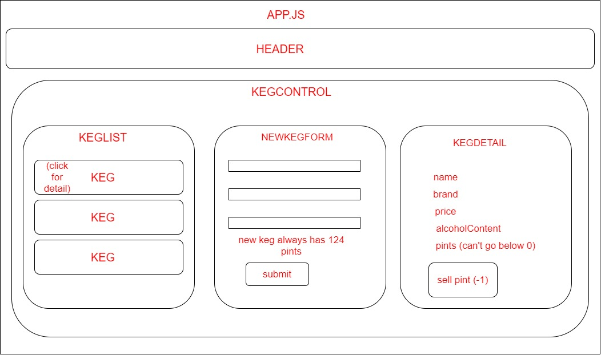

# Pierre's Pub/Tap Room
## By: Rachel Schieferstein || April 24th 2020

#### This project was bootstrapped with [Create React App](https://github.com/facebook/create-react-app).

## Description 

React/JS-based keg monitoring application for a fictional bar using local and shared State. Users can create new kegs, view existing and and added ones, and "sell" pints from them.

## Component diagram 



## Description

Practice of React click handlers and Create/Read/Update functionality.

## Setup/Installation Requirements

_In Terminal:_

* Navigate to where you want this application to be saved, i.e.:
```cd desktop```
* Clone the file from GitHub with HTTPS
```git clone https://github.com/violenzae/tap-room```
* In the root directory of the project, run ```npm install``` and then ```npm start```, which will start up an instance in your browser at http://localhost:3000.

## Known Bugs

_No known bugs at this time._

## Support and contact details

_Have a bug or an issue with this application? [Open a new issue](https://github.com/violenzae/tap-room/issues) here on GitHub._

## Technologies Used

* Node.js
* React
* Webpack
* Javascript
* HTML & CSS
* Bootstrap 4
* Create React App

### License

[MIT](https://choosealicense.com/licenses/mit/)

Copyright (c) 2020 **_Rachel Schieferstein_**